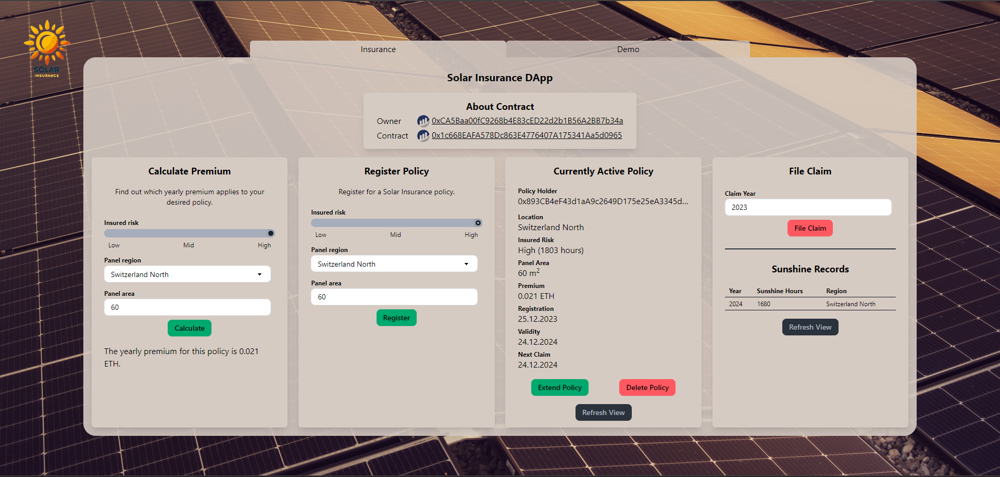

# Solar Insurance DApp Frontend

HS 2023/2024, Blockchain, Fabian Diemand  
Dozenten: Malik El Bay, Oliver Dressler  
Repository Frontend: https://github.com/FabianDiemand/solar-insurance-frontend  
Repository Smart Contract:  https://github.com/FabianDiemand/solar-insurance-smartcontract  

---

## Inhalt
* [1 Einleitung](#1-einleitung)
* [2 Smart Contract](#2-smart-contract)
* [2 Erklärung GUI](#3-erklärung-gui)
  * [2.1 Hauptansicht/ Landing Page](#31-hauptansicht-landing-page)
  * [2.2 Demo-Ansicht](#32-demo-ansicht)
* [3 Installation](#4-installation)
* [4 Demo/ Storybook](#5-demo-storybook)

---

## 1 Einleitung
Im Rahmen des Moduls Blockchain wurde sich mit Technologien, Anwendungsfällen und rechtlich-wirtschaftlichen Themen rund um die namensgebende Datenstruktur befasst. Teile des Gelernten sollten im Rahmen einer Semesterarbeit mit einer Literatur- oder Engineering-Arbeit angewandt werden.

Im Rahmen diese Semesterarbeit wurde ein Smart Contract geschrieben, der die Policies einer Versicherung für Betreiber einer Photovoltaik-Anlage (fortan PV-Anlage) modelliert. Der versicherte Schaden ist der finanzielle Mehraufwand, durch den Bezug von Strom aus dem Hauptnetz anstelle der eigenen PV-Anlage. Als Indikator für einen Schadenfall wird die Anzahl Sonnenscheinstunden pro Jahr herangezogen.

Die Erkenntnis, dass dieser Indikator nicht alleine relevant für eine Aussage über das Auftreten und das Ausmass eines potenziellen Schadens ist, ist für den Realitätsbezug relevant. Für die Semesterarbeit wird diese Feststellung nicht weiter verarbeitet. Ebenso werden Systemabhängigkeiten von Dritt-APIs zur Datenabfrage und externen Services (namentlich Chainlink) nur im Entwurf erwähnt. Der Fokus liegt auf der Umsetzung des Smart Contracts, dessen Deployment, Verifizierung und der Interaktion mit diesem durch eine grafische Schnittstelle.

## 2 Smart Contract
Die Solar Insurance DApp setzt sich aus einem Frontend und einem Smart Contract zusammen. Der Smart Contract ist unter der Adresse [0x1c668eafa578dc863e4776407a175341aa5d0965](https://sepolia.etherscan.io/address/0x1c668eafa578dc863e4776407a175341aa5d0965) auf der Seplia Testchain bereitgestellt. Deployment und Code des Contracts, sowie die ABI, Transaktionen und Event Logs können in Etherscan eingesehen werden. Weitere Details zum Smart Contract sind im Wiki zum [Source Code auf GitHub](https://github.com/FabianDiemand/solar-insurance-smartcontract), sowie in der zugehörigen Semesterarbeit dokumentiert.

## 3 Erklärung GUI
Die GUI der Solar Insurance DApp setzt sich aus einer Landing Page ('Insurance') und einer Demo Ansicht ('Demo') zusammen. Die Landing Page bildet die Zugriffsschnittstelle auf die für eine produktive Verwendung notwendigen Funktionen des Smart Contracts. Die Demo Ansicht hilft bei der Verwendung der DApp zu Demo und Test-Zwecken. Sie erlaubt Zustandsänderungen, die üblicherweise durch Interaktionen mit anderen Nutzern oder APIs ('Fund Contract', 'Create Sunshine Record') oder unter stärkeren Einschränkungen ('File Claim') möglich sind.

### 3.1 Hauptansicht/ Landing Page

Die Hauptansicht der Solar Insurance DApp unterstützt die Interaktion mit den zentralen Funktionen des Smart Contract und bietet einige Metadaten zum Smart Contract. So werden die Adresse des Owners, sowie des Contracts angezeigt und mit einer Verlinkung auf Etherscan versehen.

Mit 'Calculate Premium' kann die Prämie für die gewünschte Konfiguration der Versicherungspolice berechnet werden. Damit können mögliche Policen gegeneinander abgewogen werden, ohne dass immer der Umweg über einen angestossenen Bezahlvorgang im Wallet in Kauf genommen werden muss. Im nächsten Schritt 'Register Policy' kann die eigene Police konfiguriert und abgeschlossen werden. Erst jetzt fällt auch eine Abfrage aus dem Wallet mit dem entsprechenden Betrag für die Deckung der Prämie an. Die Policy wird nun durch einen Klick auf 'Refresh View' im nächsten Panel 'Currently Active Policy' angezeigt. Im selben Panel kann ausserdem die Policy durch einen Klick auf 'Extend Policy' jeweils um ein Jahr verlängert werden. Schliesslich kann im Panel 'File Claim' eine Deckungsleistung für einen angefallenen Schaden eingefordert werden. Die Liste der 'Sunshine Records' erlaubt eine Einsicht in erfasste Sonnenschein-Einträge. So kann ein Anwender zunächst prüfen, ob die Einforderung von Schadenleistungen erfolgsversprechend ist bzw. ob eine Diskrepanz zwischen der Versicherten Anzahl Sonnenstunden und der tatsächlichen Dauer des Sonnenscheins zum Nachteil des Anwenders vorliegt.

### 3.2 Demo-Ansicht

Die Demo-Ansicht beinhaltet Funktionen, welche nicht für den Einsatz in einem realistischen Szenario vorgesehen sind, jedoch für eine Verwendung im Kontext eines Tests oder einer Demo vorhanden sein müssen. Da in einem Demo-Szenario die Menge der Versicherten und/ oder ein Konzept für die initiale Finanzierung der Versicherung fehlt, muss der Contract über die 'Fund Contract' Oberfläche mit einer bestimmten Menge Ether vorfinanziert werden. Ebenfalls fehlt für die Umsetzung im Rahmen der Semesterarbeit eine Anbindung an eine Wetterschnittstelle, die die benötigten Sonnenschein-Daten liefert. Entsprechend müssen Aufzeichnungen manuell erfasst werden. Dafür wird die Oberfläche 'Create Sunshine Record' angeboten, die die Spezifizierung eines Jahrs, einer Region und der Anzahl Sonnenscheinstunden pro Jahr für eine Aufzeichnung erlaubt. Zuletzt muss für ein Testszenario die Kontrolle für die Einreichung eines Schadenersatzanspruchs gelockert werden, da zwischen dem Abschluss der Versicherung und der Einrichtung kein Jahr gewartet werden kann. Entsprechend greift die Oberfläche 'Fund Claim' in der Demo-Ansicht auf eine andere Schnittstelle des Vertrags zu, als jene der Hauptansicht. Die Business Logik ist identisch. 

## 4 Installation
#### Anforderungen:
- [Metamask Wallet](https://metamask.io/download/)
- [Docker Desktop](https://www.docker.com/products/docker-desktop/)

#### Anleitung:
1) Clone das Repository
   ```bash
   git clone git@github.com:FabianDiemand/solar-insurance-frontend.git
   ```
2) Navigiere in das geclonte Repository
   ```bash
   cd solar-insurance-frontend
   ```
3) Starte die Anwendung mit dem Befehl 'docker-compose up'
   ```bash
   docker-compose up
   ```
4) Die Anwendung läuft auf dem Localhost unter Port 8080 [localhost:8080](http://localhost:8080)

## 5 Demo/ Storybook
Diese Storybook bezieht sich auf den Zeitpunkt der Abgabe der Semesterarbeit. Insbesondere der Zustand der Anwendung wird sich durch die Verwendung der DApp ändern. Ebenfalls könnten zu späteren Zeitpunkten gewisse Eigenschaften nicht mehr Erfüllt sein, wodurch die Verhaltenslogik möglicherweise vom Storybook abweichen kann. Die Daten für das Storybook sind frei erfunden und dienen der Anwendung als Demo.

Das Storybook besteht aus einer tabellarischen Auflistung von Schritten, die mit einer Nummerierung, einem Titel, den involvierten GUI-Komponenten und einer Beschreibung der Aktion versehen sind.

|Schritt   |Titel   |Komponente   |Beschreibung   |
|---|---|---|---|
|1   |Prämie berechnen   |Insurance - Calculate Premium   |Berechne die Prämie einer Versicherung mit folgender Konfiguration: Insured Risk -> High, Panel Region -> 'Switzerland North', Panel area -> 60 <br> Das erwartete Resultat sind eine Prämie von **0.021 ETH**.  |
|2   |Police abschliessen   |Insurance - Register Policy   |Spiegle die Konfiguration aus Schritt 1 in der 'Register Policy'-Komponente. Schliesse daraufhin die Versicherung mit einem Klick auf 'Register' ab. Metamask wird die Bestätigung der Transaktion von 0.021 ETH und den anfallenden Gas Gebühren anfordern. <br> Warte bis die Transaktion finalisiert ist.    |
|3   |Police prüfen  |Insurance - Currently Active Policy  |Klicke den 'Refresh View' Button, um die abgeschlossene Police in der 'Currently Active Policy' Komponente angezeigt zu bekommen. Nebst deiner Adresse als 'Policy Holder' und der Konfiguratino der Police, siehst du das Abschluss-Datum, wie lange die Police gültig ist und wann der erste Anspruch geltend gemacht werden kann.   |
|4   |Schadenfälle prüfen   |Insurance - Sunshine Records / <br> Demo - Sunshine Records  |Prüfe, ob ein Schadenfall (Diskrepanz zwischen der Versicherten Anzahl Sonnenstunden und der tatsächlichen Dauer des Sonnenscheins zu deinem Nachteil) vorliegt. <br> In der Demo Ansicht erkennst du eine solche Diskrepanz im Jahr 2023, in deiner Region (du hast 1803 Stunden versichert, die Sonne schien effektiv 1600 Stunden).  |
|5   |Schadenersatz einfordern   |Demo - Claim Fund   |Den gefundenen Schaden kannst du in der Demo Ansicht geltend machen. In der Insurance Ansicht wird die Schadenmeldung durch einen Check abgelehnt, da rückwirkend keine Forderungen geltend gemacht werden können. <br> Du erhältst eine Gutschrift von 0.05 ETH.   |
|6   |Versicherung verlängern   |Insurance - Currently Active Policy   |Überzeugt von der Dienstleistung willst du die Versicherung um ein Jahr verlängern. Hierzu klickst du die 'Extend Policy' Schaltfläche in der aktuell aktiven Police. Wiederum bittet Metamask um eine Bestätigung der Transaktion. <br> Sobald die Transaktion abgeschlossen ist, kann die neue Police durch 'Reload View' aktualisiert werden. <br> Die Validität wurde um ein Jahr verlängert.   |

Analog zu diesem Beispiel können weitere Abläufe unter Einbezug eigener manuell erfasster Daten durchgespielt werden. 